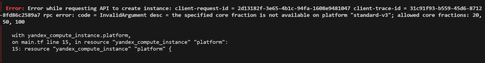
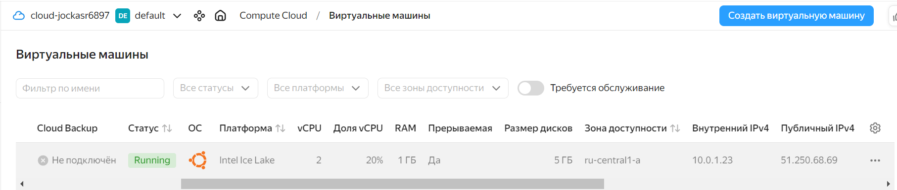
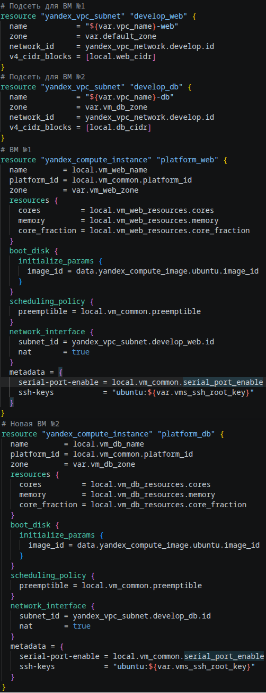
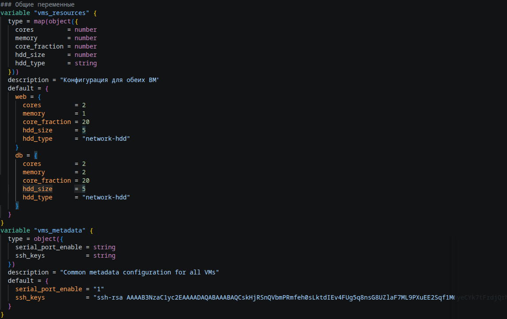
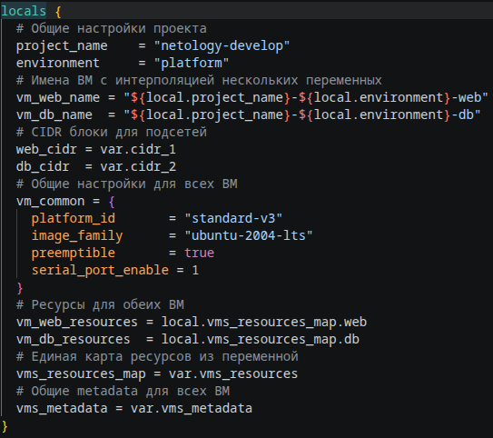
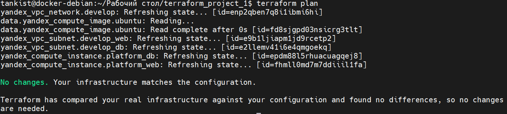

# Домашнее задание к занятию «Основы Terraform. Yandex Cloud»
Из - за технических сложностей (ручная подгрузка провайдеров Терраформа и пробема с ssh ключами и токенами для доступа к облаку) часть ответов представлено в виде ссылок на файлы или кода.</br>
Перед выполнением нового задания инфраструктура уничтожается, чтобы деньги не тратились, поэтому на скриншотах в Заданиях 3 и 4 всё создаётся с нуля.</br>
В процессе выполнения заданий 3 и далее возникла огромная проблема - Яндекс блокировал повторное создание виртулаьных машин после уничтоджения инфраструктуры, поэтому пришлось заходить с резервного Yandex ID на другом ПК (ВМ) и поднимать инфраструктуру в другом окружении.</br>
В этот раз для проекта не создавался отдельный репозиторий, поэтому файлы финальной версии (после выполнения задания 6) лежат [тут](/files/%D0%A4%D0%B8%D0%BD%D0%B0%D0%BB%D1%8C%D0%BD%D0%B0%D1%8F%20%D0%B2%D0%B5%D1%80%D1%81%D0%B8%D1%8F%20%D0%BF%D1%80%D0%BE%D0%B5%D0%BA%D1%82%D0%B0/).</br>
## Задание 1

Ошибка версии Терраформа, исправление которой требует точного прописывания версии показана на рисунке 1.1:</br>

</br>
Рисунок 1.1. Ошибка версии Терраформа.</br>
Региональная ошибка провайдеров требующая скачивания их вручную, представлена на рисунке 1.2:

</br>
Рисунок 1.2. Региональная ошибка провайдеров Терраформа.</br>
Ошибка в standart-v4. Согласно документации Yandex.Cloud (https://cloud.yandex.ru/docs/compute/concepts/vm-platforms) платформы могут быть только v1, v2 и v3. Изображено на рисунке 1.3:

</br>
Рисунок 1.3. Ошибка версии платформы.</br>
Недопустимое значение параметра core_fraction. Необходимо указать core_fraction = 20, 50 или 100, что указано на рисунке 1.4. Я установил значение 20.</br>

</br>
Рисунок 1.4. Ошибка core_fraction.</br>
В строке cores = 1 указано неправильное количество ядер процессора. Согласно документации Yandex.Cloud (https://cloud.yandex.ru/docs/compute/concepts/performance-levels) минимальное количество виртуальных ядер процессора для всех платформ равно двум. Данная ошибка продемонстрирована на рисунке 1.5:

</br>
Рисунок 1.5. Ошибка числа ядер.</br>
Далее создаём пару ssh ключей в самом облаке, после чего скачиваем архив и распаковываем его в корень диска D, после чего в файле variables.tf прописываем значение публичного ключа.</br>
После исправления всех ошибок вирутальная машина создаётся, что продемонстрирована на рисунке 1.6:

</br>
Рисунок 1.6. ВМ в облаке.</br>
Далее пробрасываем закрытый ключ в ssh клиент, что продемонстрировано на рисунке 1.7:

</br>
Рисунок 1.7. Проброс ключа.</br>
Далее подключаемся к созданной ВМ и выполняем команды из задания:
```
ubuntu@fhm4ltskh573n2gmdg00:~$ eval $(ssh-agent) && ssh-add
Agent pid 1464
ubuntu@fhm4ltskh573n2gmdg00:~$ curl ifconfig.me
51.250.68.69
```
Параметр preemptible = true применяется в том случае, если нужно сделать виртуальную машину прерываемой, то есть возможность остановки ВМ в любой момент. Применятся если с момента запуска машины прошло 24 часа либо возникает нехватка ресурсов для запуска ВМ. Прерываемые ВМ не обеспечивают отказоустойчивость. Параметр core_fraction=5 указывает базовую производительность ядра в процентах. Указывается для экономии ресурсов.</br>
Изменяемые файлы проекта на данном этапе находятся [здесь](/files/%D0%9F%D1%80%D0%BE%D0%BC%D0%B5%D0%B6%D1%83%D1%82%D0%BE%D1%87%D0%BD%D1%8B%D0%B5%20%D1%8D%D1%82%D0%B0%D0%BF%D1%8B/1/).</br>

## Задание 2

Изучил файлы проекта. Проект разбит на отдельные файлы, описывающие ядро проекта, сетевую часть, описание общих переменных, блок провайдера, блок вывода информации. Изменил хардкод-значения для ресурсов yandex_compute_image и yandex_compute_instance с добавлением префикса vm_web, что изображено на рисунках 2.1 и 2.2:</br>

</br>
Рисунок 2.1. Изменение переменных.</br>

</br>
Рисунок 2.2. Объявление переменных.</br>
Выполнил terraform plan, появилось сообщение о том, что terraform не нашел отличий от действующей инфраструктуры, что изображено на рисунке 2.3:

</br>
Рисунок 2.3. terraform plan без изменений.</br>
Изменяемые файлы проекта на данном этапе находятся [здесь](/files/%D0%9F%D1%80%D0%BE%D0%BC%D0%B5%D0%B6%D1%83%D1%82%D0%BE%D1%87%D0%BD%D1%8B%D0%B5%20%D1%8D%D1%82%D0%B0%D0%BF%D1%8B/2/).</br>

## Задание 3

Вывод команды terraform apply, где видно, что создаются две виртуальные машины, продемонстрирован на рисунке 3.1:

</br>
Рисунок 3.1. Создание ВМ №2.</br>
Наличие виртуальных машин в облаке продемонстрировано на рисунке 3.2:

</br>
Рисунок 3.2. Две ВМ в облаке.</br>
Изменяемые файлы проекта на данном этапе находятся [здесь](/files/%D0%9F%D1%80%D0%BE%D0%BC%D0%B5%D0%B6%D1%83%D1%82%D0%BE%D1%87%D0%BD%D1%8B%D0%B5%20%D1%8D%D1%82%D0%B0%D0%BF%D1%8B/3%20%D0%B8%204/).</br>

## Задание 4

Для удобства организовал в [outputs.tf](/files/%D0%9F%D1%80%D0%BE%D0%BC%D0%B5%D0%B6%D1%83%D1%82%D0%BE%D1%87%D0%BD%D1%8B%D0%B5%20%D1%8D%D1%82%D0%B0%D0%BF%D1%8B/3%20%D0%B8%204/outputs.tf) вывод информации сразу об обеих виртуальных машинах в одном болке, что продемоснстрировано на рисунке ниже:</br>

</br>
Рисунок 4.1. Вывод информации о виртуальных машинах сразу после создания.</br>
[Остальные файлы](/files/%D0%9F%D1%80%D0%BE%D0%BC%D0%B5%D0%B6%D1%83%D1%82%D0%BE%D1%87%D0%BD%D1%8B%D0%B5%20%D1%8D%D1%82%D0%B0%D0%BF%D1%8B/3%20%D0%B8%204/) после задания 3 остались без изменений.</br>

## Задание 5

Содержимое файла locals.tf с применением интерполяции для описания информации о ВМ находится [тут](/files/%D0%9F%D1%80%D0%BE%D0%BC%D0%B5%D0%B6%D1%83%D1%82%D0%BE%D1%87%D0%BD%D1%8B%D0%B5%20%D1%8D%D1%82%D0%B0%D0%BF%D1%8B/5/locals.tf).</br>
На рисунке ниже продемонстрирована чать файла main.tf в которой продемонстрированы изменения после создания locals.tf:</br>

</br>
Рисунок 5.1. Файл main.tf.</br>
Остальные файлы с изменениями согласно данному заданию находятся [здесь](/files/%D0%9F%D1%80%D0%BE%D0%BC%D0%B5%D0%B6%D1%83%D1%82%D0%BE%D1%87%D0%BD%D1%8B%D0%B5%20%D1%8D%D1%82%D0%B0%D0%BF%D1%8B/5/).</br>

## Задание 6

Объединение переменных в файле [vms_platform.tf](files/%D0%A4%D0%B8%D0%BD%D0%B0%D0%BB%D1%8C%D0%BD%D0%B0%D1%8F%20%D0%B2%D0%B5%D1%80%D1%81%D0%B8%D1%8F%20%D0%BF%D1%80%D0%BE%D0%B5%D0%BA%D1%82%D0%B0/vms_platform.tf) продемонстрировано на рисунке 6.1:</br>

</br>
Рисунок 6.1. Объединение переменных.</br>
Изменения в файле [locals.tf](files/%D0%A4%D0%B8%D0%BD%D0%B0%D0%BB%D1%8C%D0%BD%D0%B0%D1%8F%20%D0%B2%D0%B5%D1%80%D1%81%D0%B8%D1%8F%20%D0%BF%D1%80%D0%BE%D0%B5%D0%BA%D1%82%D0%B0/locals.tf) продемонстрированы на рисунке 6.2:</br>

</br>
Рисунок 6.2. Файл locals.tf.</br>
Команда terraform plan изменение не выявила, что продемонстрировано на рисунке 6.3:

</br>
Рисунок 6.3. terraform plan.</br>